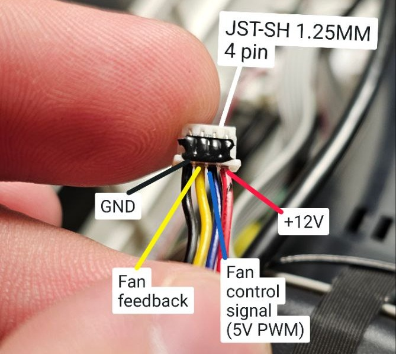

# L018_Fan
Usually projector runs fan for high power with no feedback from actual temperature.
Custom fan controller for chinese projector to make them quieter.
Optionally you can connect OLED

  
  

- Install `Arduino IDE 2` if not installed already
- Place `Libraries` content to `C:\Users\[YOUR_USERNAME]\Documents\Arduino\Libraries`
- Install board `Drivers` (usually clone boards uses CH341 driver) if not installed already
- Open project from `Firmware\ProjectorFanController`
- Connect board, add it as Arduino Nano, compile and upload project.
- Some boards will flash as `ATMega328p (Old Bootloader)` and some as `ATMega328p`.
- Check if all working: Open SERIAL(115200) and see log. All 3 sensors should show valid temperature and react to change
- Assemble in projector, attach all sensors to lamp radiator, corner of LCD, CPU. Best glue for that is silicone.

Made by Dr.Failov in Ukraine